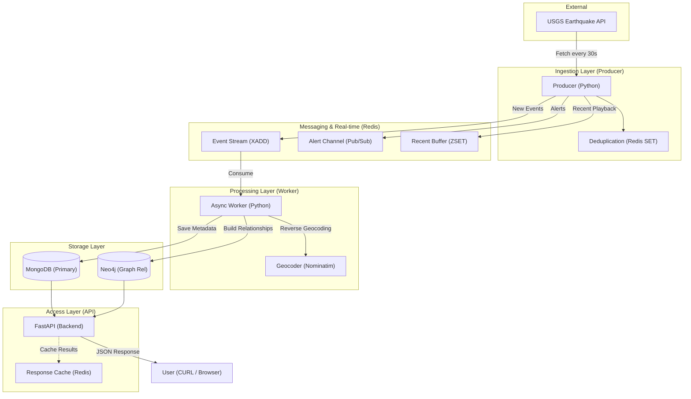

# 🌍 Earthquake Monitor System

Welcome to the **Earthquake Monitor System**! This project is a real-time platform that tracks seismic activity worldwide, provides advanced analytics, and identifies relationships between earthquakes.

---

## 🚀 Key Features

The system is built across 5 phases of development:

### 📡 Phase 1: Live Monitoring (MVP)
*   **Real-Time Feed**: Fetches live data from the USGS (U.S. Geological Survey) every 30 seconds.
*   **Intelligent Processing**: Automatically processes and stores new events.
*   **Instant Alerts**: Notifies about high-magnitude earthquakes significantly impacting regions.

### 🗺️ Phase 2: Visualization & Exploration
*   **Heatmaps**: Identifies "hot zones" of seismic activity.
*   **Advanced Filtering**: Filter earthquakes by depth, specific regions (California, Alaska, etc.), magnitude, and time.
*   **Event Details**: View full metadata including nearby cities and detailed location addresses.

### 📊 Phase 3: Analytics & Intelligence
*   **Trend Analysis**: Track daily earthquake counts over time.
*   **Magnitude Distribution**: See how many earthquakes fall into different intensity levels.
*   **Correlation Analytics**: Analyze the relationship between earthquake depth and magnitude.

### 🕸️ Phase 4: Graph & Relationship Insights
*   **Aftershock Detection**: Automatically links smaller earthquakes to their "Main Shocks" based on time and distance.
*   **Cascade Event Detection**: Identifies potential triggered events across different fault zones (e.g., an earthquake in one fault triggering another nearby).

### ⚖️ Phase 5: Risk & Prediction Insights
*   **Regional Risk Scoring**: Calculates a 0-100 risk score for regions based on historical and recent activity.
*   **Unusual Activity Alerts**: Detects spikes in activity that differ significantly from historical averages.

---

## 🛠️ Technical Architecture

The system uses a highly scalable, event-driven architecture to ensure no seismic event is missed.

### System Architecture


### Data Flow Diagram (Mermaid)


### Components
*   **Backend (Python/FastAPI)**: The brain of the system, handling all logic and APIs.
*   **Real-Time Pipeline (Redis)**: Ensures data flows instantly from the internet to your screen.
*   **Primary Storage (MongoDB)**: Stores all historical and detailed earthquake data.
*   **Relationship Graph (Neo4j)**: Maps how earthquakes, regions, and fault lines are connected.

---

## 🏃 How to Run the Project

### Prerequisites
1.  **Docker Desktop**: Required to run the databases and system. [Download here](https://www.docker.com/products/docker-desktop/).
2.  **VS Code**: Recommended for viewing the code.

### Quick Start
1.  **Open Docker Desktop** and ensure it is running.
2.  Open your terminal or command prompt in the project root folder.
3.  Run the following command:
    ```bash
    docker-compose up --build
    ```
4.  Wait for the logs to stop scrolling. The first run might take 1-2 minutes to download everything.

---

## 📍 Access Links
*   **Main Web App**: [http://localhost:5173](http://localhost:5173) (Currently under development)
*   **Interactive API Dashboard**: [http://localhost:8000/docs](http://localhost:8000/docs) (Best for testing!)
*   **Neo4j Graph Browser**: [http://localhost:7474](http://localhost:7474) (Login: `neo4j` / Pass: `test1234`)

### 📚 Detailed Documentation
For more in-depth technical details, please refer to:
- [Developer Manual](file:///Users/anushkayadav/Documents/GitHub/earthquake-monitor/MANUAL.md) - Deep dive into architecture and internals.
- [Features & Filters Guide](file:///Users/anushkayadav/Documents/GitHub/earthquake-monitor/FEATURES.md) - Comprehensive list of every API capability.
- [Data Flow Explanation](file:///Users/anushkayadav/Documents/GitHub/earthquake-monitor/data_flow_explanation.txt) - Masters-level data lifecycle breakdown.

---

## 🧪 Testing the Features (For Professor)

Use these links in your browser to see the "live" intelligence of the engine:

1.  **Live Updates**: [Latest Earthquakes](http://localhost:8000/earthquakes/latest)
2.  **Risk Scores**: [Top Risk Regions](http://localhost:8000/analytics/risk-scores)
3.  **Aftershocks**: [Detected Sequences](http://localhost:8000/analytics/aftershocks)
4.  **Heatmap Data**: [Seismic Density](http://localhost:8000/earthquakes/heatmap?start_time=0&end_time=9999999999999)
5.  **Anomalies**: [Unusual Activity Report](http://localhost:8000/analytics/unusual-activity)

---

## 🛠️ Troubleshooting
*   **Connection Refused**: Ensure Docker Desktop is running.
*   **Neo4j Login**: Use password `test1234`. If it asks to change, you can skip or use the same one.
*   **System Reset**: To clear all data and start fresh:
    ```bash
    docker-compose down -v
    docker-compose up --build
    ```
