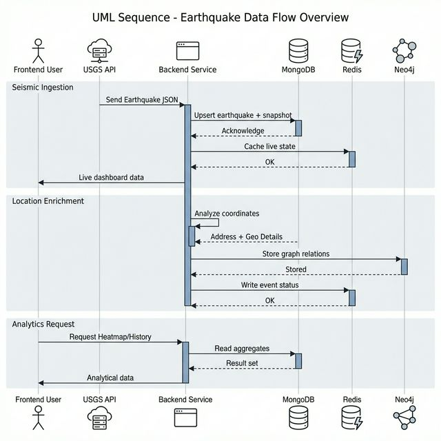

# Real-Time Earthquake Monitoring System

An advanced, distributed software platform designed for high-velocity seismic data ingestion, enrichment, and analytical visualization. This project demonstrates a **Polyglot Persistence** architecture, utilizing specialized database engines to solve distinct data challenges: real-time streaming, geospatial indexing, and graph-based relationship modeling.

---

## 🏗️ System Architecture

The application is built on a microservice-oriented architecture, containerized with Docker for seamless orchestration.

### Polyglot Persistence Layer
- **Redis (Speed)**: Manages the high-frequency event stream and provides a low-latency pub/sub channel for real-time dashboard updates.
- **MongoDB (Geospatial Document Store)**: Acts as the primary historical archive. Leverages `2dsphere` indexing for efficient spatio-temporal queries and heatmap generation.
- **Neo4j (Graph Logic)**: Maps complex seismic relationships, including aftershock sequences, cascade events, and spatial proximity to fault lines and urban centers.

### Data Flow
1. **Ingestion**: The **Producer** fetches data from the USGS API every 30-60 seconds and publishes to a Redis Stream.
2. **Processing**: The **Async Worker** consumes the stream, resolves coordinates into human-readable addresses via reverse geocoding, and performs parallel writes to MongoDB and Neo4j.
3. **Delivery**: The **FastAPI Backend** serves as the gateway, providing RESTful endpoints and WebSocket connections for the **Next.js** frontend.

---

## 🌟 Key Features

### 📡 Real-Time Intelligence
- **Live Ingestion**: Continuous monitoring of global seismic activity with automated deduplication and regional threshold alerting.
- **Reverse Geocoding**: Automated enrichment of raw coordinates into precise location addresses.

### 📊 Advanced Analytics
- **Spatio-Temporal Clustering**: Uses the DBSCAN algorithm to detect "seismic swarms" and group events by density.
- **Risk Assessment**: Dynamic scoring system for geographical regions based on historical frequency and magnitude intensity.
- **Trend Analysis**: Statistical distribution of magnitudes and daily occurrence trends.

### 🕸️ Graph-Based Relationship Detection
- **Seismic Chains**: Automated detection of Aftershocks and Foreshocks based on time/distance decay rules.
- **Inter-Fault Triggering**: Identifies cascade events where activity on one fault zone correlates with stress transfer to another.

---

## 🛠️ Technology Stack

| Layer | Technology |
| :--- | :--- |
| **Language** | Python 3.9+, TypeScript |
| **Backend Framework** | FastAPI |
| **Frontend Framework** | Next.js, Leaflet.js |
| **Databases** | Redis, MongoDB, Neo4j |
| **Orchestration** | Docker, Docker Compose |

---

## 🚀 Installation & Setup

### Prerequisites
- [Docker Desktop](https://www.docker.com/products/docker-desktop/)
- Node.js (Optional, for manual frontend development)
- Python 3.9+ (Optional, for manual backend development)

### Quick Start with Docker
1. Clone the repository and navigate to the project root.
2. Build and start the entire stack:
   ```bash
   docker-compose up --build
   ```
3. The system will automatically provision the databases, start the ingestion services, and launch the web interface.

---

## 📍 Access Ports

| Service | URL |
| :--- | :--- |
| **API Documentation (Swagger)** | [http://localhost:8000/docs](http://localhost:8000/docs) |
| **Neo4j Browser** | [http://localhost:7474](http://localhost:7474) (Login: `neo4j` / Pass: `test1234`) |

---

## 📐 technical Specifications

### Data Flow Model
The following diagram illustrates the lifecycle of a seismic event, from edge ingestion to persistent storage and real-time broadcast.



### Logical Entity-Relationship Model
The schema is designed for high-performance retrieval of both spatial attributes and graph-based seismic relationships.


---

## 📚 API Endpoints (Highlights)

- `GET /earthquakes/latest`: Retrieves newest events from the Redis buffer.
- `GET /earthquakes/heatmap`: Aggregated density data for map visualization.
- `GET /analytics/risk-scores`: Calculated safety metrics per region.
- `GET /analytics/aftershocks`: Graph-traversed seismic sequence pairs.

---

## 📜 Academic References
- *Designing Data-Intensive Applications* (Kleppmann, 2017)
- *Graph Databases in Practice* (Robinson et al., 2015)
- *USGS Earthquake Hazards Program* (Data Source)
